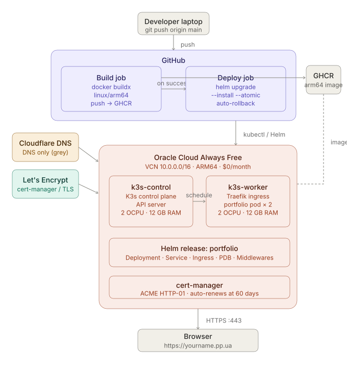

# Portfolio — Cloud & DevOps engineering project

**Live site → https://sumedhvartak.pp.ua**

A personal portfolio site that is itself the DevOps project.
The infrastructure it runs on demonstrates the full stack:
self-managed Kubernetes, automated CI/CD, Helm packaging,
TLS certificate automation, and zero-downtime rolling deploys
all at zero cost on Oracle Cloud Always Free.

---

## Architecture

| Component | Technology | Notes |
|-----------|-----------|-------|
| Container runtime | Docker (linux/arm64) | ~25 MB nginx:alpine image |
| Orchestration | K3s v1.28 | Lightweight K8s, 2-node cluster |
| Infrastructure | Oracle Cloud Always Free | 2× ARM64 VMs, 4 OCPU, 24 GB RAM total |
| CI/CD | GitHub Actions | Build + push + deploy on every push to main |
| Image registry | GitHub Container Registry (GHCR) | Free for public repos |
| Ingress | Traefik (Helm) | HTTP→HTTPS redirect, www redirect |
| TLS | cert-manager + Let's Encrypt | Auto-renews at 60 days |
| Packaging | Helm chart | Versioned releases, one-command rollback |
| DNS | Cloudflare (free) | DNS-only mode for cert-manager compatibility |

---

## CI/CD pipeline

Every push to `main` triggers this pipeline (typical run: ~90 seconds):

\`\`\`
git push
  └─► GitHub Actions
        ├─ docker buildx build --platform linux/arm64
        ├─ docker push → ghcr.io/YOURUSERNAME/portfolio:sha-XXXXXXX
        └─ helm upgrade --install --atomic
              ├─ kubectl applies Deployment, Service, Ingress, PDB
              ├─ RollingUpdate: maxSurge=1, maxUnavailable=0
              ├─ Waits for readinessProbe (/healthz) on all pods
              └─ Auto-rollback via --atomic if deploy fails
\`\`\`

---

## Key engineering decisions

**Why K3s instead of a managed service (EKS/GKE)?**
Managed Kubernetes costs $70–150/month minimum. K3s on Oracle Always Free
is genuinely $0. K3s is production-grade (CNCF certified) and used by
companies like Rancher, Vercel, and in edge deployments.

**Why linux/arm64?**
Oracle's Always Free ARM instances (Ampere A1) give 4× more compute than
the free x86 tier. ARM64 Docker images are built via docker buildx
cross-compilation on the GitHub Actions runner (x86_64).

**Why Helm over raw kubectl?**
Helm tracks release history, enables one-command rollback, and lets you
parameterise values (image tag, domain, replica count) without editing
manifests. Every deploy is a versioned, auditable release.

**Why cert-manager over manual TLS?**
Certificates auto-renew — zero operational toil. The 90-day Let's Encrypt
cycle is handled entirely by cert-manager watching the Certificate resource
and re-running the ACME HTTP-01 challenge before expiry.

---

## Repo structure

\`\`\`
portfolio/
├── .github/workflows/deploy.yml  # CI/CD — build and deploy pipeline
├── helm/portfolio/               # Helm chart
│   ├── Chart.yaml
│   ├── values.yaml               # All configurable defaults
│   └── templates/                # Deployment, Service, Ingress, PDB, Middlewares
├── cert-manager/                 # ClusterIssuer manifests (staging + production)
├── index.html                    # Portfolio site
├── style.css
├── nginx.conf                    # /healthz + /nginx_status endpoints
└── Dockerfile                    # Multi-stage, nginx:alpine, linux/arm64
\`\`\`

---

## Running locally

\`\`\`bash
docker build -t portfolio:local .
docker run -p 8080:80 portfolio:local
# Open http://localhost:8080
\`\`\`

## Deploying (done automatically by CI/CD on push to main)

\`\`\`bash
helm upgrade --install portfolio helm/portfolio/ \
  --namespace portfolio \
  --set image.tag=sha-XXXXXXX \
  --set ingress.host=sumedhvartak.pp.ua \
  --atomic --wait
\`\`\`

## Rollback

\`\`\`bash
helm history portfolio -n portfolio   # list all releases
helm rollback portfolio 1 -n portfolio --wait
\`\`\`

---

## What's coming next (Phase 2)

- Prometheus + Grafana observability stack
- Loki log aggregation
- Alertmanager with Slack notifications
- Chaos engineering (Chaos Mesh)
- LLMOps / RAG application with full observability